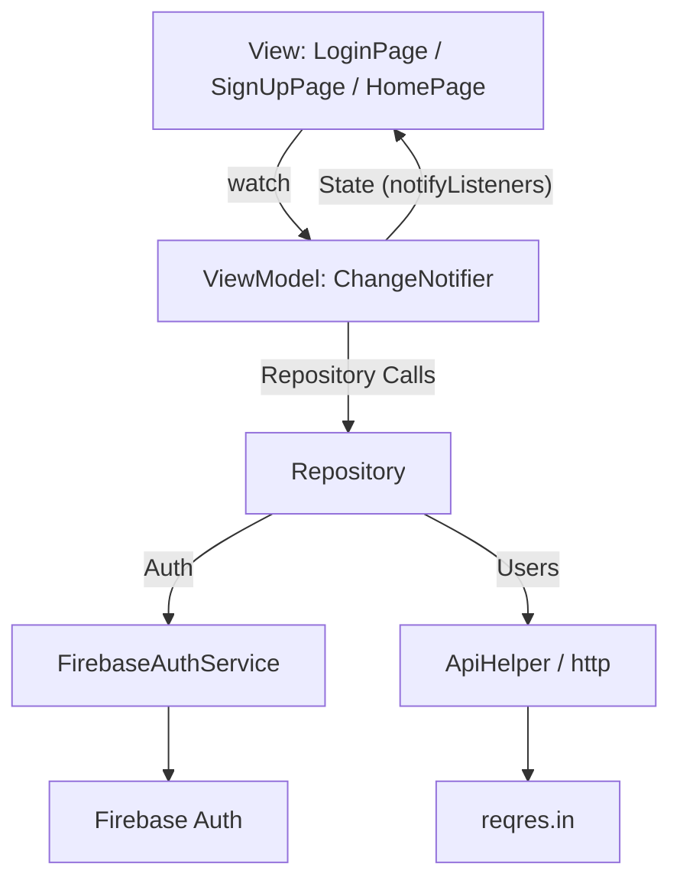

# 👥 User Directory

**A Flutter machine-test app: Firebase email/sign-up auth + an infinite-scroll paginated user list, built with an MVVM + Repository pattern.**

[](https://flutter.dev)
[](https://pub.dev/packages/provider)
[](https://firebase.google.com)

---

## ✨ Features

- **Firebase Auth** — email/password login & sign-up, with friendly error messages mapped from `FirebaseAuthException`.
- **Session Persistence** — `shared_preferences` remembers login state so a restart skips the login screen.
- **Paginated User List** — infinite scroll against [reqres.in](https://reqres.in), 5 users per page, loads more near the bottom.
- **Cached Avatars** — `cached_network_image` for user avatars.
- **Pull to Refresh** — resets to page 1 and refetches.

---

## 🏗️ Architecture

MVVM with a repository layer sitting between `ChangeNotifier` view models and the API/auth services.



---

## 🛠️ Tech Stack

| Package | Usage |
|---|---|
| `provider` | State management |
| `firebase_auth` | Email/password authentication |
| `http` | REST client for the user list API |
| `shared_preferences` | Local login-state persistence |
| `cached_network_image` | Avatar image caching |

---

## 🚀 Getting Started

### Prerequisites
- Flutter 3.8+
- A Firebase project with Email/Password auth enabled (`firebase_options.dart` already configured)

### Run
```bash
flutter pub get
flutter run
```

---

## 📂 Project Structure

```
lib/
├── core/
│   ├── constants/          # AppRoutes, AppUrls
│   ├── network/             # ApiHelper (http client)
│   └── services/             # FirebaseAuthService, SharedPreferencesService
├── data/
│   ├── models/               # userModel
│   └── repositories/         # AuthRepository, UserRepository
├── viewmodels/               # AuthViewmodel, UserViewmodel
├── views/
│   ├── auth/                 # LoginPage, signUpPage
│   └── user_list/            # HomePage (paginated list)
└── main.dart
```
